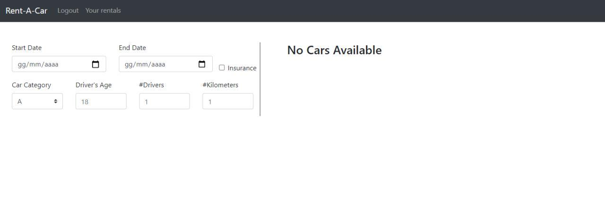

# Exam #1: "Car Rental"
## Student: s269358 MADEO THOMAS

## React client application routes

- Route `/carbrowser`: Allows unlogged users to browse all cars, contains the filters and shows the results
- Route `/login`: Allows the users to log in, contains a login form
- Route `/rentacar`: Allows the user to rent a car, contains a form and shows the results (available cars and price)
- Route `/rentacar/payment`: subtitute the rent form with a paymentform, allows users to pay and confirm a rental
- Route `/rentBrowser`: contains a list of past, current and future rentals, allows users to delete future rentals

## REST API server

- GET `/api/cars`
  - request: the parameters of the query are a number of categories and brands, used to filter
  - response: a list of car that respects the filters
- POST `/api/login`
  - request: The body contains email and password
  - response: a user object (id and email)
- GET `/api/user`
  - request: The id of the user who made the request
  - response: a user object (id and email)
- GET `/api/proposal`
  - request: The parameters of the query (startDate, endDate, insurance, carCategory, driverAge, numberOfDrivers, numberOfKm) used to get proposals, the body contains the userID
  - response: The price and the number of available cars of the proposal for this user
- GET `/api/rentals`
  - request: the body contains the userID
  - response: A list of rentals made by the user
- DELETE `/api/rental/:rentalId`
  - request: the id of the rental to delete
  - response: only the status code
- POST `/api/rental/:rental`
  - request: the body contains the userID and the parameters for the new rental (startDate, endDate, insurance, carCategory, driverAge, numberOfDrivers, numberOfKm)
  - response: the id of the new rental
- POST `/api/rental/payment`
  - request: the body contains data of the payment card (cardNumber, name, CVV)
  - response: just the status code
## Server database

- Table `users` - contains id, email, password
- Table `rentals` - contains id, user, car, startDate, endDate, price, insurance, numberOfKm, numberOfDrivers, driverAge
- Table `cars` - contains id, model, brand, category

## Main React Components

- `RentCarPage` (in `components/RentCarPage/RentCarPage.js`): fetches and contain the state used by RentForm and PriceResult, renders the basic graphic of the page
- `RentForm` (in `components/RentCarPage/RentForm.js`): renders and manage the form to add new rentals
- `PriceResult` (in `components/RentCarPage/PriceResult.js`): shows the available number of cars and the price of a proposal
- `Payment` (in `components/GuestPage/Payment.js`): renders and controls a form used for payments

- `GuestPage` (in `components/GuestPage/GuestPage.js`): fetches and contain the state used by CarList and Filters, renders the basic graphic of the page
- `CarList` (in `components/GuestPage/CarList.js`): Shows the list of cars that respects given Filters
- `Filters` (in `components/GuestPage/Filters.js`): renders and controls the filters used to select the car in CarList

- `RentalList` (in `components/RentalPage/RentalList.js`): fetches and show current, past and future rentals of the current user

- `Header` (in `components/Header`): renders the header

## Screenshot

## Test users

* Gianfranco@rentacar.it, ciao (frequent customer)
* Viktor@rentacar.it, kino
* Robert@rentacar.it, crimson
* Steven@rentacar.it, smith
* Paul@rentacar.it, wings
